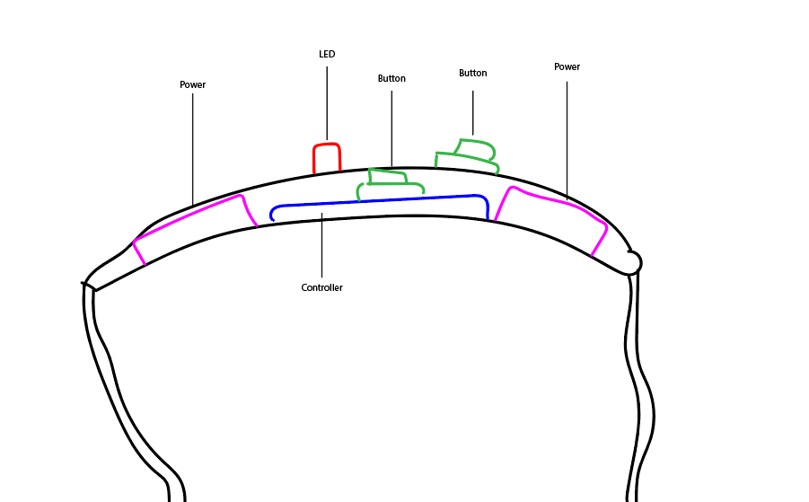

[Tinker Prototype](https://www.tinkercad.com/things/cxCh6t1Y2ge-beacon/editel?sharecode=e02bZv-Jv98e_OfJb_4sWsGuCPGCTxXm-ka0hbHdLpc), [Adjusted time + logic for easier simulation](https://www.tinkercad.com/things/kalajjJ0ELt-beacon-shorter-loop/editel?sharecode=kI8jqzcV9iJEHNINy2pNKujgFdF6Syo2gdhzYY-bvwc)

*Note: The description of this sci-fi machine takes the form of a far future civilization uncovering the machines workings and beginning to explore it's ethical implications. I've been reading lot's of dystopian sci-fi recently so this is where my mind went. It's a mix of ideas I've stolen from William Gibson, N.K. Jemisin, and Margaret Atwood*

**A new theory of "Beacons" as they relate to the mass extinction event and drastic human population decline of the previous millennium commenly known as "The Great Collapse"**

*Transcribed recording of lecture by Prof. Sabine Gilenna at the 6th annual Pre Civilisation Conference, 14th June 3167.*

___

Welcome, all. Today, I will briefly overview current discourse surrounding "The Great Collapse" era and the "Beacons". Then present new insight into the beacons technology and a novel theory based on this and newly restored historical documents.

While research into Pre Civilisation artefacts has produced much insight into the technology and structures of the day, the near-extinction level population decline leading to the "Silence Era" and the subsequent "Rebirth Era" has been an area with much mystery and little agreement between practitioners. 

As we know, the previous population is estimated to have been between five and ten billion people. While challenging to comprehend, recent findings by Iodoia Deschler put this figure at the higher end of this bracket. From decay analysis of the primary building material, concrete, the collapse seems to have happened simultaneously across the globe.

While there has been evidence of extreme climate shifts and mass extinction of much of the planet's species, models suggest this alone would not be sufficient to cause such a complete change to this civilisation in the timeframe. 

Alongside the mystery of the simultaneous collapse, there are the puzzling artefacts, commonly referred to as "Beacons". These devices, named after a particular component discovered to emit light, have been found in large quantities globally. Beacons appear to have been wrist-mounted and, aside from the light-emitting element mentioned, features mechanical push switches referred to as buttons. One is on the device's front, and the other appears to be hidden from view and held down by a clasp. 

There is broad debate on the origins and uses of these devices. Some theories include the Beacons as a way to find other survivors in volcanic dust clouds. While geologic layers of volcanic dust allude to a large scale eruption at some point in the period lend some credibility to this theory, the spread of the dust is far from global enough to explain the abundance of these devices across the world. 

Similarly, the communication theory lacks compelling evidence, despite being the most widely accepted. A single device of this type can transmit light effectively at a relatively limited distance, and many uncertainties surround translation mode. 

Grädel's recent "Information Net Theory" addresses some of these issues: every viewer repeats a signal to spread a message over a vast distance. But geographical spacing and the ample room for error in repetition seem impassible as far as the theory is concerned.

In my opinion, no theory thus far has addressed the second button adequately, hidden from the wearer, and few viable ideas have been put forward for its purpose.

While complete analysis is still in the preliminary stages, I would like to share findings from my team with you today, which I believe will finally "shed light" on current disputes and lay the groundwork for an evidence-based theory.

We have recently discovered a dig site appearing to be a manufacturing or design facility for Beacon devices. Many remarkably well-preserved devices, parts, and schematics were inside, and this has allowed my team to begin to reverse engineer their workings. The logic of the device goes as follows:

- The device works on a 24-hour cycle and will reset at the end unless it meets certain conditions.
- In the first 16 hours of the day (the assumption is this leaves time for sleep), there is a slight random chance that the light will turn on automatically at any moment.
- When the light is on, the wearer must press the button. The time to deactivate the device appears to begin at 2 seconds but gets progressively shorter with each success. 
- If the wearer fails to press the button, the light stays on regardless of a cycle ending. 
- If the internal button is ever released, then the light turns on permanently. Its location suggests this is to avoid tampering. 

At first, this puzzled us; it seems to lean more to the much-contested entertainment theory of Beacons being merely games. However, recently restored electronic documents in conjunction with this lead us to an entirely different interpretation. Therefore, I will now present to you a preliminary explanation for the true nature of Beacon devices, "Culling Theory."

The Beacon was designed to advise who lives and who dies. 

It is unclear how far society had fallen at this point, but the governments of the time were sure that killing for resources among the world's population was inevitable. All they could apparently think to do was to guide the course of the "cull". So they chose a survival metric, which you may have guessed by now, was reaction speed.

The exact rationale for this decision remains undiscovered, but we can hypothesise that this could be due to lowered reaction speeds that came with age or illness. Most likely, however - taking into account the decision was undoubtedly made by a collection of national leaders - is that in theory, this would not discriminate based on nationality or race, each nation represented in the remains of humanity. It is currently unknown how much the population was aware of the reasons behind the device.

Critiquing the logic of this "equality" is a trivial matter. Many of the best minds of our time have physical impairments, and the idea that a curable sickness that may last only days could be a permanent death mark is intolerable. Why only a single measurement of "survivability" was selected is unknown. Perhaps it was manufacturing constraints or the only commonality between opinions. 

I'm sure that much discussion will come analysing what would have been the "correct" or "most equal" metrics to choose, but I would not wish to be the one who decided. Imagine how different our society could look if our forebears chose another measurement. So the best I feel we can say for our predecessors in Pre-Civilisation is, with waning options at the precipice, a decision was made, and we are here. 

In closing, I hope that this insight into the inner workings of the device and new theory of the collapse of Pre Civilisation help us not only to learn from their mistakes and illuminate more about how our era began. But, unfortunately, there is no current hard evidence as to how people used these Beacons during The Great Collapse and The Silent Era. The overwhelming amount of human remains with these devices paints a bloody picture. Still, the numerous large concentrations of the artefacts without bodies points to perhaps an abandonment by communities - maybe it was something as simple as the power source running out. Clearly, we have much left to uncover. 

Thank you all for listening. The full paper will be released shortly. I will be taking questions now.

[end of recording]
