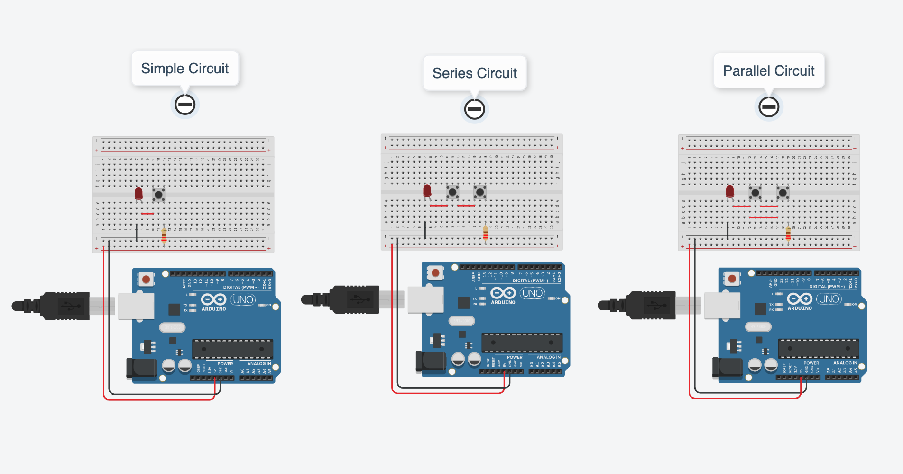
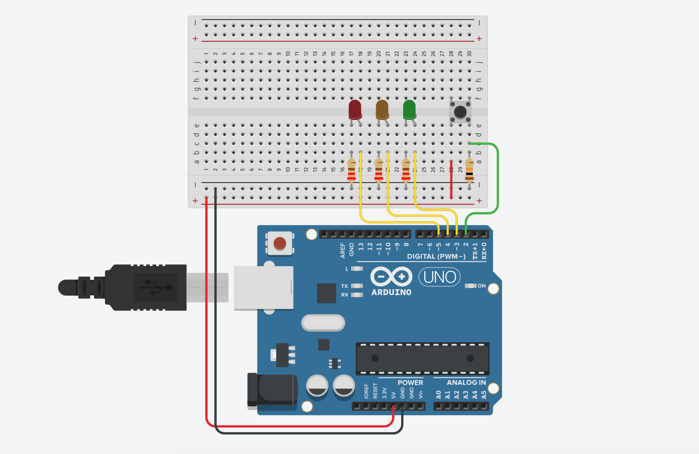
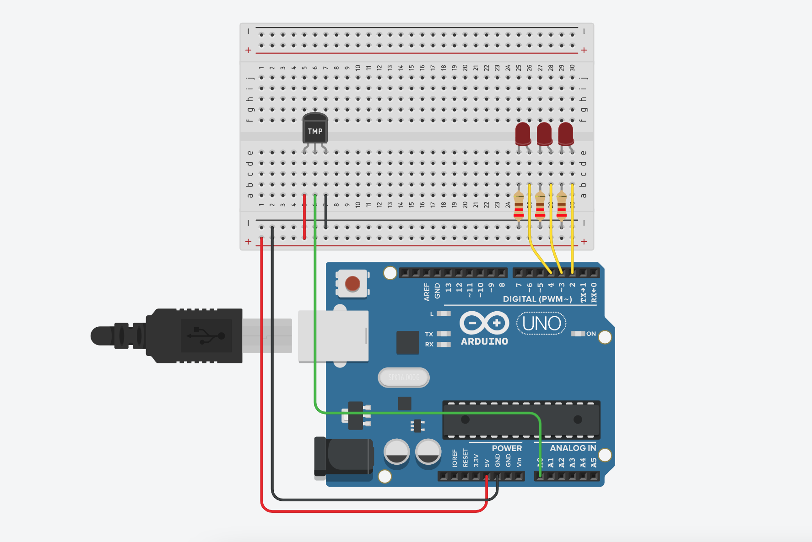

# Arduino Labs

- [Project 1 ](https://www.tinkercad.com/things/dFhLeeLJRAq-funky-habbi-allis/editel?sharecode=QgovKTnmXBkvhHC9G2dQHbbyR6QPsqXSPvw3CS3AC3Y&sharecode=QgovKTnmXBkvhHC9G2dQHbbyR6QPsqXSPvw3CS3AC3Y) 
- [Project 2 ](https://www.tinkercad.com/things/7GN2PLTpAHT-powerful-borwo/editel?sharecode=rdnWN2x_63HxoEEuPJLlQlBFnMsALfpO12Q8FVbQsTM)
- [Project 3 ](https://www.tinkercad.com/things/kPk8b1u67um-shiny-uusam/editel?sharecode=HxAmL7ZCfnmACcTpY7Jxqtdn09hA4rifOaRDFYsKhlw)